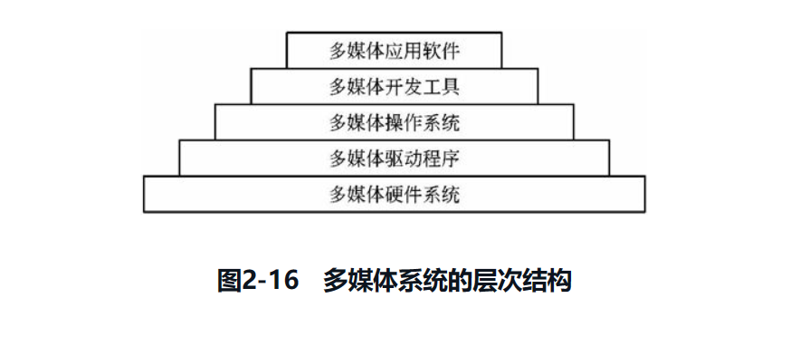

# 计算机基础知识 
## 操作系统基础知识
 1. 操作系统os是计算机系统的核心系统软件。
 2. 层次：计算机硬件+操作系统+语言处理程序+应用程序
 3. 定义：
    - 包括：处理机CPU，存储器（主存与外存）,输入输出
    - 作用：
        - 通过资源管理，提高计算机系统的效率
        - 改善人机界面，向用户提供友好的工作环境。
    - 分类：
        - 单用户操作系统 批处理操作系统
        - 分时操作系统 实时操作系统
        - 网络操作系统 分布式操作系统
        - 嵌入式操作系统
    - 特征：
        - 并发性（concurrency）
        - 共享性（sharing)
        - 虚拟性（virtual)
        - 不确定性（non-determinacy)
    - 功能：
        - 进程管理
            - 进程（process）是资源分配和独立运行的基本单位
            - 定义
                - 进程是程序的一次执行，该程序可以和其他程序并发执行
            - 组成
                - 程序
                - 数据
                - 经常控制块(PCB)-描述进程基本情况，是进程村咋的唯一标志
            - 分类：
                - 系统进程，用户进程
                - 父进程，子进程
            - 状态转换与控制
                -  
                -  
                -  
            - 进程控制源语：
                - 创建原语
                - 撤销原语
                - 挂起原语
                - 激活原语
                - 阻塞原语
                - 唤醒原语
            - 互斥与同步，pv操作
                - 同步：进程间互相发送消息互相合作，互相等待
                - 互斥：使用某一公共资源且不允许交叉顺序执行，只有一个进程访问
                - 临界资源：只能供一个进程使用 CR
            - 临界区管理原则： 
                - 临界区cs是进程对临界资源实施操作的那段程序
                - 原则：有空即进，无空则等，有限等待，让权等待
            - 信号机制
                - 分类：
                    - 公用信号量： 实现进程间的互斥，初值=1或资源的数目
                    - 私用信号量： 实现进程间的同步，初值=0或某个正整数。
                - S意义：
                    - S>=0表示某资源的可用数
                    - S<0 绝对值表示阻塞队列中等待该资源的进程数
            - PV操作
        - 进程通信与管程
            - 通信：进程间的信息交换
            - 通信分类： 控制信息的交换，数据的交换
            - 管程：
        - 进程调度与死锁
            - 进程调度： 分配处理器给哪个进程
            - 调度方式与算法：
                - 分类：可剥夺和不可剥夺
                - 算法：
                    - 先来先服务
                    - 时间片轮转
                    - 优先级调度
                    - 多级反馈调度算法
                - 死锁： 两个以上的进程互相都因对方已经占用的资源，无限期地等待并无法继续运行下去的现象
                 - 原因：
                    - 互斥条件
                    - 请求保持条件
                    - 不可剥夺条件
                    - 环路条件
                - 解决：
                    - 鸵鸟策略
                    - 预防策略
                    - 避免策略
                    - 检测与解除死锁
            - 线程
        - 存储管理
            - 存储器是计算机系统的关键性资源，是存放各种信息的主要场所
            - 概念
                - 存储器结构：
                    - 寄存器——主存——外存
                    - 寄存器-缓存-主存-外存
                - 逻辑地址：用户程序编译后，每个目标以0为基地址进行的顺序编址。相对地址，程序地址，虚拟地址
                - 物理地址： 主存各存储单元的地址，从统一的基地址进行的顺序编址，是主存中真实地址，可以寻址并实际存在
                - 存储空间： 逻辑地址空间逻辑地址集合，物理地址空间物理地址集合
            - 地址重定位：
                - 静态重定位，动态重定位
            - 存储管理功能：
                - 主存储器的分配和回收，提高主存储器的利用率，存储保护，主存扩充
            - 存储管理方式：
                - 分区存储管理
                - 分页存储管理
                - 分段存储管理
                - 段页存储器管理
                - 虚拟存储管理
            

            
        - 设备管理
            - 分类
                - 设备使用：存储设备，输入输出设备，终端设备和脱机设备
                - 资源分配： 独占设备，共享设备 虚拟设备
                - 设备从属：系统设备和用户设备
                - 数据组织： 块设备和字符设备
                - 数据传输速率：低速设备，中速设备，高速设备
                - 输入输出： 人机通信设备，机机通信设备
                - 交互设备： 非交互，交互
            - 主要技术
                - 中断技术
                - DMA技术
                - 缓冲技术
                - 虚设备与SPOOLING
            - 设备管理软件
                - 中断处理程序
                - 设备驱动设备
                - 与设备无关的系统软件
                - 用户层IO软件
            - 数据传输控制方式
                - 程序控制方式
                - 中断方式
                - 直接存储访问方式
                - 通道方式
            - 磁盘调度算法
                - 先来先服务 FCFS
                - 最短寻道时间优先SSTF
                - 扫描算法SCAN
        - 文件管理
            - 文件File具有符号名，在逻辑上具有完整意义的一组相关信息项集合
            - 文件类型
                - 性质和用途：系统文件，库文件，用户文件
                - 安全属性：只读文件，读写文件，可执行文件和不保护文件
                - 组织方式： 普通文件，目录文件，设备文件
                - 保存期限： 临时文件，档案文件和永久文件
                - 信息流向： 输入文件，输出文件，输入输出文件
            - 文件结构和组织
                - 文件逻辑结构
                    - 有结构的记录文件
                    - 无结构的字符流文件
                - 文件物理结构
                    - 连接结构 链式结构
                    - 索引结构 多物理块索引表
            - 文件访问方法
                - 顺序访问
                - 随机访问
            - 文件存储设备管理
                - 对空闲空间的组织，分配与回收
                - 方法： 有位图法，索引法，链接法
            -  文件控制块和文件目录
                - 文件控制块是系统为每个文件设置用于描述和控制文件的数据结构，是文件存在的唯一标志FCB
                - FCB内容： 基本信息，位置信息，存取控制信息，使用信息
                - 形式:
                    - 一级目录结构
                    - 二级目录结构
                    - 多级目录结构
            - 文件使用
                - 目录命令：建立目录，显示工作目录，改变目录，删除目录
                - 文件控制命令： 建立，删除，打开，关闭，改变文件名，改变文件属性文件
                - 文件存取命令： 读写文件，显示文件内容，复制文件
            - 文件安全
                - 文件的保密和保护，限制非法用户使用和破坏文件
                
        - 作业管理
            - 作业控制
                - 作业：系统完成一个用户的计算任务所做的工作总和
                - 作业：程序+数据+作业说明书
                - 作业程序： 操作系统中用来控制作业进入，执行和撤销的一组程序
                - 作业采用脱机和联机机制控制
                - 作业控制块JCB是记录与该作业有关的各种信息的登记表
                JCB是作业存在的唯一标志（用户名，作业名，状态标志）
            - 作业状态
                - 内容:  
            - 作业调度及其常用调度算法:
                - 先来先服务
                - 短作业优先
                - 响应比高优先
                - 优先级调度
                - 均衡调度算法
            - 用户界面
         - 网络操作系统
            - 特征：
                - 独立性
                - 多用户支持
                - 支持网络实用程序
                - 管理功能
                - 多客户端支持
            - 分类
                - 集中模式
                - 客户机/服务器模式
                - 对等模式
        - 案例：
            - unix
            - window
            - linux
    
## 数据库基础知识
- 概念
    - 数据库： 长期存储在计算机内，有组织的可共享的数据集合
    - 数据库系统DBS： 数据库，硬件，软件和人员组成，管理对象是数据
    - 数据库管理系统DBMS： 一种操作和管理数据库的大型软件，用于建立使用和维护数据库（数据定义，数据库操作，数据库运行管理，数据组织，存储和管理，数据库建立与维护）
    - 分类
        - 关系数据库系统 RDBS
        - 对象数据库系统 OODBS
        - 对象关系数据库系统 ORDBS

    - 关系数据库
        - 数据库结构与模式：  
    - 实体联系ER模型
        - ER图：  
    - 数据规范化
        - 无损连接
        - 保存函数依赖性
            - 函数依赖包含函数依赖，非平凡函数依赖，平凡函数依赖，完全函数依赖，部分函数依赖，传递依赖，码，主属性和非主属性，外码，值依赖定义，函数依赖公理系统
        - 约束范式
            - 1NF 第一范式
            - 2NF 第二范式
            - 3NF 第三范式
            - BCNF 巴克斯范式
            - 4NF 第四范式
            - 5NF 5NF⊂4NF⊂BCNF⊂3NF⊂2NF⊂1NF成立
    - 事务管理
        - 原子性
        - 一致性
        - 隔离性
        - 持久性
    - 并发控制
         - 排他锁
        - 共享锁
    - 数据备份与恢复
        - 进行数据转储和建立日志文件
        - 转储： 静态转储，动态转储，海量转储，增量转储
        - 故障：事务故障，系统故障，介质故障，计算机病毒
        - 故障恢复： 撤销事务undo，重做事务redo
- 关系数据库设计
    - 特点：
        - 从数据模型开始
        - 静态结构设计与动态结构设计分离
        - 试探性
        - 反复性和多步性
    - 方法
        - 直观设计法
        - 规范设计法
        - 计算机辅助设计法
        - 自动化设计法
        - 实用的：
            - 基于3NF的设计方法
            - 基于实体联系ER数据库设计方法
            - 基于视图概念的数据库设计方法
            - 面向对象的关系数据库设计方法
            - 计算机辅助数据库设计方法
            - 敏捷数据库设计方法
    - 数据库设计步骤
        - 步骤： 需求分析，概念结构设计，逻辑结构设计，物理结构设计，应用程序设计，运行维护
        - 内容： 
        - 需求分析：
            - 任务：对现实世界要处理的对象进行详细调查，了解现行系统概括，确定新系统功能的过程中，收集支持系统目标的基础数据及其处理方法
            - 前提： 用户调查上，分析明确用户对系统的需求
            - 方法：通过自顶向下，逐步分解的方法分析系统
            - 结果：需求说明书
        - 概念结构设计
            - 前提：需求分析基础上
            - 任务：对用户信息加以分类，聚集和概括，建立信息模型，根据数据库管理系统软件将信息转换为数据的逻辑结构，并最终实现数据的合理存储
            - 方法： 自顶向下，自底向上，逐步扩张，混合策略
            - 过程： 设计局部ER模型，设计全局ER模型，优化全局ER模型
        - 逻辑结构设计
            - 前提：概念结构产出的数据模型
            - 任务：确定数据模型，将ER图转为指定数据模型，确定完整性约束，确定用户视图
        - 物理结构设计
            - 数据在物理设备上的存储结构与存取方法
            - 工作： 存储记录的格式设计，存储结构设计，存取方法设计，确定系统配置
        - 数据库应用程序设计
            - 工作： 选择设计方法，制定开发计划，选择系统架构，设计安全性策略
            - 方式： 结构化设计方法，面向对象设计方法
        - 数据库运行和维护
            - 工作： 数据库的转储和恢复，数据库的安全性和完整性控制，数据库性能监督，分析和改造，数据库的重组和重构
    - 分布式数据库系统
        - 概念：DDBS
        - 特点：数据集中控制性，数据独立性，数据冗余可控性，场地自治性，存取有效性
        - 体系结构： 
        - 分层： 全局外层，全局概念，局部概念层，局部内层
        - 应用： 分布式计算，internet应用，数据仓库，数据复制
    - 商业智能
        - 商业智能BI，企业对商业数据的搜集管理和分析的系统过程
        - 商业智能系统实现: 原始业务数据转为企业决策信息的过程
            - 数据预处理
            - 建立数据仓库
            - 数据分析
            - 数据展示
        - 数据仓库
            - 数据仓库是一个面向主题，集成的相对稳定的，且随时间变化的数据集合，支持管理部门决策过程
            - 特点：
                - 面向主题
                - 集成的
                - 非易失的
                - 时变的
            - 结构： 
            - 实现：
                - 规划，需求研究
                - 问题分析，数据抽取清洗
                - 集成装载，数据仓库设计
                - 数据仓库管理，分析报表查询
                - 数据仓库性能优化 数据仓库部署发布
        - 海量数据分析器：OLAP
            - 分类
                - 关系数据库ROLAP ，多维i数据库MOLAP
                - 混合数据组织HOLAP
        - 数据挖掘
            - 功能：
                - 自动预测趋势和行为
                - 关联分析
                - 聚类
                - 概念描述
                - 偏差检测
            - 技术
                - 关联分析
                - 序列分析
                - 分类分析
                - 聚类分析
                - 预测与时间序列分析
            - 流程
                - 确定挖掘对象
                - 准备数据
                - 建立模型
                - 数据挖掘
                - 结果分析
                - 知识应用
            - 应用
        - 数据库管理系统
            - oracle
            - ibmdb2
            - sybase
            - microsoft sql server

## 计算机网络基础知识
1. 网络概述
    - 分类
        - 距离： 广域网WAN 局域网LAN 城域网MAN
        - 信息： 电路交换网，分组交换网，综合交换网
        - 拓扑： 星形，树形，环形，总线型
        - 介质： 双绞线，同轴电缆，光纤网，卫星网
        - 带宽： 基带，宽带
        - 范围： 公用，专用
        - 速率： 高，中，低
        - 传播： 广播，点到点
        - 方式：校园网，企业网
        - 连接： 内联网，外联网
2. 模型：
     
3. 协议
    - 应用层：FTP、TFTP、HTTP、SMTP、DHCP、Telnet、DNS 和 SNMP
    - 传输层：TCP 和 UDP(User Datagram Protocol，用户数据 报协议)
    - 网络层：IP、ICMP、IGMP
4. IPV6
    - 1.地址分类：单播、多播(也称作组播)、泛播(也称作任意播)
    - 2.与4比较：更大的地址空间、更小的路由表、
    - 3.过渡技术：双协议栈技术、隧道技术、NAT-PT 技术
5. 网络存储技术
    - 1.DAS：直接附加存储，直接将存储设备连接到服务器上，难以扩展，依赖I/O
    - 2.NAS：网络附加存储，一个专用的文件服务器
    - 3.SAN：存储区域网络，通过专用交换机将磁盘阵列与服务器连接起来的高速专用子网
        - FC SAN：光纤通道
        - IP SAN：基于 IP 网络
## 多媒体技术及其应用
 1. 媒体：
    - 分类： 感觉媒体，表示媒体，显示媒体，存储媒体，传输媒体
 2. 多媒体：
    - 技术特征
        - 多样性，集成性，交互性，实时性
    - 压缩编码
        - JPEG
        - MPEG
        - MPEG-7 MPEG-21 DVI
    - 压缩方法
        - 无损压缩编码
        - 压余压缩法熵编码
        - 有损压缩编码
    - 多媒体系统层次：
          

## 系统性能

1. 硬件性能，软件性能，指标：性能指标，性能计算，性能设计，性能评估
2. 性能指标
    1. 计算机
        - 可靠性
        - 可用性
        - 可维护性
        - 完整性
        - 安全性
        - 平均故障响应时间
        - 兼容性
        - 可扩充性
        - 性能价格比

    2. 路由器
    3. 交换机
    4. 网络
    5. 操作系统：
        -  可靠性，吞吐量，响应时间，资源利用率，可移植性
    6. 数据库管理系统
    8. web服务器
        - 并发连接量，响应延迟，吞吐量
3. 性能计算
    1. 计算公式
4. 性能设计
    1. 性能调整
    2. 阿姆达尔解决方案
    3. 性能评估
        1. 基测试程序
        2. web服务器的性能评估
        3. 系统监视

----

# 信息系统基础知识

## 信息化
1. 信息特征
    - 客观性 ：信息反映了客观事物的运动状态和方式
    - 普遍性：物质的普遍性决定了信息的普遍存在，因而信息无所不在。
    - 无限性： 由于一切事物运动的状态和方式都是信息，而事物及其变化是无限多样的，因而信息是无限的。
    - 动态性：信息是随着时间的变化而变化，因而是动态的。
    - 依附性:信息不能完全脱离物质而独立存在。
    - 变换性:信息是可变换的，它可以用不同的载体以不同的方法来负载。
    - 传递性：信息可以在时间上或空间上从一点传递到另一点
    - 层次性：客观世界是分层次的，反映它的信息也是分层次的.
    - 系统性：信息可以表示为一种集合，不同类别的信息可以形成不同的整体
2. 信息化：
    - 内容:
        - 信息资源的开发利用
        - 信息网络的全面覆盖
        - 信息技术的广泛应用
        - 信息产业的大力发展
        - 信息产业的大力发展
        - 信息化人才的培养
        - 信息化政策法规和标准规范建设
    - 需求：
        - 战略需求
        - 运作需求
        - 技术需求
    - 信息化战略
        - 推进国民经济信息化
        - 推行电子政务
        - 建设先进网络文化
        - 推进社会信息化
        - 完善综合信息基础设施
        - 加强信息资源的开发利用
        - 提高信息产业竞争力
        - 建设国家信息安全保障体系
        - 提高国民信息技术应用能力，造就信息化人才队伍
    - 信息系统工程总体规划
        - 目标范围
            - 创造性分析
            - 批判性分析
        - 方法论
            - 关键成功因素法（Critical Success Factors, CSF）
            - 战略目标集转化法（Strategy Set Transformation, SST）
            - 企业系统规划法（Business System Planning, BSP）
    - 软件架构组成
        - 文件服务器架构
        - 典型的客户/服务器两层架构
        - 客户/服务器N层架构
        - 基于Web的架构
    - 实现过程
        - 购置安装
        - 建立数据库
        - 程序设计
        - 系统转换
        - 试运行
3. 应用
    - 电子政务
        - 分类
            - G2G（政府对政府）
            - G2B （政府对企业）
            - G2C（政府对居民）
            - B2G（企业对政府）
            - C2G(居民对政府)
        - 阶段
            - 起步阶段
            - 政府与用户单向互动
            - 政府与用户双向互动
            - 网上事务处理
        - 应用领域
            - 面向社会应用
            - 政府部门之间应用
            - 政府部门内部各类应用系统
            - 涉及政府部门内部的各类核心数据应用系统
            - 政府电子化采购
            - 电子社区
    - 企业信息化和电子商务
        - 企业信息化
        - 企业信息化的目的
            - 技术创新
            - 管理创新
            - 制度创新
        - 企业信息化规划
            - 企业战略层面
            - 业务运作层面
            - 管理运作层面
    - 企业信息化方法
        - 业务流程重构方法
        - 核心业务应用方法
        - 信息系统建设方法
        - 主题数据库方法
        - 资源管理方法
        - 人力资本投资方法
    - 企业资源规划结构和功能
        - ERP概念
            - 物流
            - 资金流
            - 信息流
            - 内容：  

        - ERP结构
            - 内容：  
        - ERP功能
            - 支持决策的功能
            - 为不同寒夜提供针对性的IT解决方案
            - 企业内部的供应链发展为全行业和跨行业的供应链
    - 客户关系管理
        - CRM 客户关系管理
        - 内容：
            - 销售自动化
            - 营销自动化
            - 客户服务与支持
            - 商业智能
        - 方案：
            - 内容： 
    - 企业门户
        - 功能： 个性化，演示功能，知识及内容的创建于管理，搜寻和检索，元数据管理分类，查询报告与分析，数据管理和应用集成，文档管理，协同和信息共享，虚拟社区，流程支持，商业功能，集中式目录支持和门户管理，安全功能
        - 企业门户的分类
            - 企业信息门户
            - 企业知识门户
            - 企业应用门户
            - 垂直门户
        - 要素：
            - 计划和设计
            - 技术决策
            - 行政人员支持
            - 限定初始项目的范围
            - 超过组织物理界限的扩展
            - 信息组织
            - 内部推广和门户使用范围
            - 门户实施中的社会和心理因素
            - 用户对门户的持续管理和支持
    - 电子商务
        - 类型
            - 按参与交易的对象分类
                - 企业与消费者之间的电子商务
                - 企业与企业之间的电子商务
                - 企业与政府方面的电子商务
            - 按交易涉及的商品内容分类
                - 间接电子商务
                - 直接电子商务
            - 按电子商务使用网络类型分类
                - EDI电子数据交换
                - 因特网电子商务
                - 内联网络电子商务
        - 标准
            - 基于xml的电子商务标准
            - 基于web服务的电子商务集成标准
    - 企业应用集成
        - EAI ：通讯服务，信息传递，转化服务，应用连接服务，流程控制服务
        - 集成内容：
            - 深度
                - 数据集成
                - 应用系统集成
                - 业务流程集成
            - 广度：
                - 部门内部信息系统集成
                - 部门之间的信息集成
                - 企业级信息系统集成
                - 稳定关系合作伙伴业务过程集成
                - 随机合作伙伴业务集成过程
    - 供应链管理
        - 定义
        - 思想
        - 运作模式
        - 技术支持
    - 法律
        - 电信条例

# 系统开发基础知识

## 软件开发方法
1. 软件开发生命周期
    - 定义，开发，使用，维护，废弃
    - 软件定义，软件开发，软件运行，维护
    1. 定义时期
        - 问题定义，是什么，系统定位以及范围，说明是一种说明性质的系统
        - 可行性研究：技术，经济，可操作性，社会可行性
        - 需求分析： 确定软件系统的功能需求，性能需求，运行环境的约束，写出软件规格说明书，软硅胶系统测试大概，用户手册概要。
            - 产出：软件需求规格说明书SRS
    2. 开发时期：
        - 软件设计与实现，概要设计，详细设计，编码，测试
        - 概要设计
            - 在需求规格说明书的基础上建立系统的总体结构和模块间的关系，定义功能模块和各个模块之间的关系
        - 详细设计
            - 把功能模块租补细化，把模块内部细节转化为可编程的程序过程性描述
            - 工作：算法与数据结构，数据分布，数据组织,模块间接口信息，用户界面设计
            - 产出： 详细设计报告
        - 编码：
            - 转化为程序
        - 测试：
            - 单元测试，集成测试，确认测试，系统测试
    3. 软件运行和维护

2. 软件开发模型
    1. 软件描述。必须定义软件功能以及使用的限制
    2. 软件开发。
    3. 软件有效性验证。
    4. 软件进化
    5. 开发模型
        - 瀑布模型
            - 内容：
                  
            - 缺点：
                - 软件需求分析的准确性很难确定，甚至是不可能和不现实的
                - 用户和软件项目负责人要相当长的时间才能得到初始版本，这时如果改变需求，将会带来巨大的损失
        - 原型模式
            - 内容：
                
            - 缺点
            - 优点
        - 螺旋模式
            - 内容：目标设定，风险分析，开发和有效性验证，评审
              -   
        - 基于可重用构件的模型
            - 
        - 基于面向对象的模型
            - 
        - 基于4代技术的模型
        - 敏捷方法
            - 特点
                - 适应性
                - 面向人
            - 核心思想
                - 适应型
                - 以人为基本
                - 迭代开发
            - 内容
                - 沟通
                - 简单
                - 反馈
                - 勇气
            - 价值价值观
                - 简单设计
                - 测试驱动
                - 代码重构
                - 结对编程
                - 持续集成
                - 现场客户
                - 发行版本小型化
                - 系统隐喻
                - 代码集体所有制
                - 规划策略
                - 规范代码
                - 40小时工作机制
            - xp极限编程，水晶系列

    6. RUP
        - 生命周期：
            - 业务建模
            - 需求
            - 分析与设计
            - 实现
            - 测试
            - 部署
            - 配置与变更管理
            - 项目管理
            - 环境
        - 循环阶段
            - 初始化阶段（定义最终产品视图和业务视图，确定系统范围）
            - 细化阶段（设计及确定系统的体系结构，制定工作计划及资源要求）
            - 构造阶段（构造产品并继续演进需求、体系结构、计划直至产品提交。）
            - 移交阶段  
        - 核心
            - 角色
            - 活动
            - 制品
            - 工作流
        - 特点：
            - 用例驱动
            - 体系结构为中心
        - 视图描述：
            - 
            - 分析人员和测试人员关心的是系统的行为，因此会侧重于用例视图
            - 用户关心的是系统的功能，因此会侧重于逻辑视图
            - 程序员关心的是系统的配置、装配等问题，因此会侧重于实现视图
            - 系统集成人员关心的是系统的性能、可伸缩性、吞吐率等问题，因此会侧重于进程视图
            - 系统工程师关心的是系统的发布、安装、拓扑结构等问题，因此会侧重于部署视图
    7. 软件系统工具
        - 软件开发工具
            - 需求分析工具
            - 基于自然语言或图形描述工具
            - 基于形式化需求定义语言的工具
            - 其他需求分析工具
        - 设计工具
        - 编码与排错工具
            - 编码工具
                - 编辑程序
                - 汇编程序
                - 生成程序
            - 排错工具
                - 源代码排错程序
                - 排错程序生成程序
        - 软件维护工具
            - 版本控制工具
            - 文档分析工具
            - 开发信息库工具
            - 逆向工程工具
            - 再工程工具
        - 软件管理
            - 项目管理工具
            - 配置管理工具
            - 软件评价工具
            - 软件开发工具的评价与选择
                - 功能
                - 易用性
                - 稳健性
                - 硬件要求和性能
                - 服务和支持
        

## 需求管理
1. 主要活动：
    
2. 原则
    - 目标
        - 为软件需求建立一个基线，提供给软件工程和管理使用
        - 软件设计，产品和活动与软件需求保持一致性。
3. 需求属性
    - 创建需求的事件
    - 需求的版本号
    - 创建需求的作者
    - 负责认可该软件需求的人员
    - 需求状态
    - 需求的原因和根据
    - 需求涉及的子系统
    - 需求涉及的产品版本号
    - 使用的验证方法或者接受的测试标准
    - 产品的优先级或者重要程度
    - 需求的稳定性
4. 需求变更
    - 变更控制过程
        
    - 变更控制委员会
5. 需求跟踪
    -   

## 开发管理
1. 项目的范围，时间，成本
    1. 范围：
        -  项目章程
        - 项目范围管理计划
        - 组织过程资产
        - 批准的变更申请
    2. 时间：
        - 活动定义
        - 活动排序
        - 活动资源估算
        - 活动历时估算
        - 制定进度计划
        - 进度控制
    3. 成本：
        - 成本估算
        - 成本预算
        - 成本控制
2. 配置管理，文档管理
    1. 配置管理：
        - 通过技术与行政的手段对产品及其开发过程和生命周期进行控制规范的一系列措施和过程
        - 配置项
            - 属于产品组成部分：需求文档，设计文档，源代码，测试用例
            - 属于项目管理和机构支撑过程域产生的文档，工作计划，项目质量报告，项目跟踪报告
    2. 文档管理
        - 要求
            - 必须描述如何使用这个系统
            - 必须描述怎么安装和管理这个系统
            - 必须描述系统需求和设计
            - 必须描述系统的实现和测试
        - 用户文档
            - 描述系统功能和使用方法
            - 内容：
                - 功能描述：说明系统能做说明
                - 安装文档： 说明怎么安装这个系统以及怎么使系统适应特定硬件配置
                - 使用手册： 简要说明如何着手使用这个系统
                - 参考手册： 详尽描述用户可以使用的所有系统设施以及它的使用方法
                - 操作员指南：说明操作员如何处理使用出现的各种情况
            
        - 系统文档
            - 系统设计实现和测试
3. 质量域风险
    1. 软件质量
    2. 软件开发风险
## 设计方法
    1. 结构化分析与设计
    2. 面向对象分析与设计
        1. 分析用例
        2. 设计技术支持设施
        3. 设计用户界面
        4. 精化设计模型
        5. 设计过程
            - 

## 软件重用
    - 横向重用
        - 重用不同应用领域中的软件元素（需求分析文档，设计过程，设计文档，代码，测试用例，领域知识）
    - 纵向重用
        - 一类具有较多公共性的应用领域之间进行软部件重用
    - 重用原理
        - 

## 逆向工程与重构工程
    - 恢复信息级别
        - 实现级：程序的抽象树，符号表等
        - 结构级：程序分量之间的相互依赖关系
        - 功能级： 程序段功能及程序段之间关系的信息
        - 领域级： 程序分量或程序实体与应用领域概念之间对应关系的信息
    - 恢复方法
        - 用户指导下的搜索与变换（实现级，结构级）
        - 变换式方法（除了领域级）
        - 基于领域知识的（）功能级，领域级
        - 铅板恢复法（实现级和结构级）

            

# 软件架构设计
## 架构概念
 1. 定义
    1. 分析设计在满足规定需求方面的有效性
    2. 在设计变更相对容易的阶段，考虑体系结构可能的选择方案
    3. 降低与软件构造相关的风险
 2. 软件架构设计与生命周期
    - 需求分析阶段
        1. 如何根据需求模型构建sa模型
        2. 如何保证模型转换的可追踪性
    - 设计阶段
        1. sa基本概念：sa模型由哪些元素组成
        2. 体系结构描述语言ADL
        3. SA模型的多视图表示
            - 经典（逻辑视图，进程视图，开发视图，物理视图）
            - hofmesiter： 概念视图，模块视图，执行视图，代码视图
            - views and beyond：模块视图，构件视图，连接子视图，分配视图
    - 实现阶段
        1. 研究基于sa的开发过程支持（项目组织结构，配置管理）
        2. 寻求sa向实现过渡的途径（sa阶段，模型映射，构件组装，复用中间件）
        3. 研究基于sa的测试技术啊
    - 构件组装阶段
        1. 由构件引起的失配
        2. 由连接子引起的失配
        3. 由系统成分对全局体系结构的假设存在冲突引起的失配
    - 部署阶段
        - 提供高层的体系结构视图描述部署阶段的软硬件模型
        - 基于sa模型可以分析部署方案的质量属性，从而选择合理的部署方案
    - 后开发阶段
        1. 动态软件体系结构
            - 体系结构设计阶段的支持
            - 运行时刻基础设施的支持
        2. 体系结构恢复与重建
            - 手工体系结构重建
            - 工具支持的手工重建
            - 通过查询语句来自动建立聚集
            - 使用其他技术比如数据挖掘
    - 重要性
        - 架构设计能够满足系统的品质
        - 架构设计使受益人达成一致的目标
        - 架构设计能够支持计划编制过程
        - 架构设计对系统开发起指导性作用
        - 架构设计能够有效地管理复杂性
        - 架构设计为复用奠定基础
        - 架构设计能够降低维护费用
        - 架构设计能够支持冲突分析

## 基于架构的软件开发方法
 1. 设计方法
    - 基于体系结构的软件设计ABSD，体系结构驱动，构成体系结构的商业，质量和功能需求的组合驱动
        1. 功能的分解
        2. 通过选择系统结构分析来实现质量和商业需求
        3. 软件模板的使用
 2. 概念术语
    1. ABSD设计元素
        - 
    2. 视角与视图
        - 选择的特定视角或视图也就是逻辑视图、进程视图、实现视图和配置视图
    3. 用例和质量场景
        - 定义特定场景来捕获质量需求，并称这些场景为质量场景
 3. 基于体系结构的开发模型
    1. ABSDM模型把整个基于体系结构的软件过程划分为体系结构需求、设计、文档化、复审、实现和演化等6个子过程
        - 
    2. 体系结构需求
        - 需求获取:系统的质量目标,系统的商业目标,系统开发人员的商业目标
        - 标识构件:
        
           - 生成类图
           - 对类进行分组
           - 把类打包成构件
        - 架构需求评审
           - 小组审查（用户要求，类分组，构件合并）
    3. 体系结构设计
          
        - 提出软件体系结构模型
        - 把已标识的构件映射到软件体系结构中
        - 分析构件之间的相互作用
        - 产生软件体系结构
        - 设计评审
    4. 体系结构文档化
        - 体系结构规格说明
        - 测试体系结构需求的质量设计说明书
    5. 体系结构复审
        - 发现问题与风险，缺陷与错误
    6. 体系结构实现
        - 
    7. 体系结构的演化
         - 
         - 需求变化归类(对用户需求的变化进行归类，使变化的需求与已有构件对应)
         - 制订体系结构演化计划
         - 修改、增加或删除构件
         - 更新构件的相互作用
         - 构件组装与测试
         - 技术评审
    
## 软件架构风格
1. 软件架构风格概述
2. 经典软件体系结构风格
    - 管道和过滤器
        - 介绍：(每个构件都有一组输入和输出，数据输入构件，经过内部处理，然后产生数据输出)
        - 结构：
            
    - 数据抽象和面向对象组织
        - 介绍：建立在数据抽象和面向对象的基础上，数据的表示方法和它们的相应操作封装在一个抽象数据类型或对象中
        - 结构：  
             
    - 事件驱动系统
        - 介绍：一个事件的触发就导致了另一模块中的过程的调用
    - 分层系统
        - 介绍：除了一些精心挑选的输出函数外，内部的层接口只对相邻的层可见
        - 结构：
              
    - 仓库系统及知识库
        - 介绍：两种不同的构件：中央数据结构说明当前状态，独立构件在中央数据存储上执行。
        - 传统数据库：构件控制共享数据
        - 黑板： 中央数据结构的当前状态触发进程执行的选择
        - 结构：
               
    - C2风格
        - 介绍： 通过连接件绑定在一起按照一组规则运作的并行构件网络
        - 规则：
            1. 系统中的构件和连接件都有一个顶部和一个底部。
            2. 构件的顶部应连接到某连接件的底部，构件的底部则应连接到某连接件的顶部。而构件与构件之间的直接连接是不允许的。
            3. 一个连接件可以和任意数目的其他构件和连接件连接。
            4. 当两个连接件进行直接连接时，必须由其中一个的底部到另一个的顶部。
        - 结构
             
    - 客户/服务器风格
         - 结构
             
            
        - 表示层
            - 用于用户从工作站输入的数据，并显示应用输出的数据
        - 功能层
            - 负责具体的业务处理逻辑
        - 数据层
            - 负责管理对数据库数据的读写
    - BS风格
         - 结构
             

        
## 特定领域软件体系结构
 1. DSSA定义
    - 在一个特定应用领域中为一组应用提供组织结构参考的标准软件体系结构
    - 特征
        - 一个严格定义的问题域和问题解域
        - 具有普遍性
        - 对整个领域的构件组织模型的恰当抽象
        - 具备该领域固定的、典型的在开发过程中可重用元素。
    - 域：
        - 垂直域
        - 水平域
2. 基本活动
    - 领域分析
    - 领域设计
    - 领域实现
3. DSSA人员
    - 领域专家
    - 领域分析人员
    - 领域设计人员
    - 领域实现人员
4. DSSA建立过程
    - 定义领域范围
    - 定义领域特定的元素
    - 定义领域特定的设计和实现需求约束
    - 定义领域模型和体系结构
    - 结构
        
    
## 系统架构的评估
 1. 属性
    - 性能：
        要经过多长时间才能对某个事件做出响应，或者在某段事件内系统所能处理的事件的个数。
    - 可靠性：
        - 定义
        ： 软件系统在应用或系统错误面前，在意外或错误使用的情况下维持软件系统的功能特性的基本能力。
        - 衡量：
            可靠性通常用平均失效等待时间（meantime to failure, MTTF）和平均失效间隔时间（mean time between failure, MTBF）来衡量
        - 容错：

        - 健壮性：
    - 可用性：系统能够正常运行的时间比例

    - 安全性：系统在向合法用户提供服务的同时能够阻止非授权用户使用的企图或拒绝服务的能力
    - 可修改性
        - 可维护性
        - 可扩展性
        - 结构重组
        - 可移植性
    - 功能性：系统所能完成所期望的工作的能力
    - 可变性：指体系结构经扩充或变更而成为新体系结构的能力
    - 互操作性
 2. 概念
    - 敏感点：
        一个或多个构件（和/或构件之间的关系）的特性
    - 权衡点：
        影响多个质量属性的特性，是多个质量属性的敏感点
    - 风险承担者
3. 主要评估方法
    - SAAM
        - 特定目标
        - 评估技术
        - 质量属性
        - 风险承担者
        - 体系结构描述
        - 方法活动
        - 目前知识库可重用性
        - 方法验证
        
    - ATAM
        - 特定目标
        - 质量属性
        - 风险承担者
        - 体系结构描述
        - 评估技术
        - 方法活动
        - 领域知识库可重用性
        - 方法验证
        
        

# UML建模与架构文档化
## UML现状与发展
## UML 基础
## 基于UML的软件开发过程
## 系统架构文档化

# 设计模式
## 组成元素
## 分类
## 实例

# XML技术
## 概述
## 命名空间
## DTD
## XML Schema
## 可扩展样式表语言

# 面向构件的软件设计
## 构件概念
## 构件布线标准
## 构件框架

# 构件平台与典型架构
## OMG方式
## SUN方式
## Microsoft 方式

# 信息安全技术
## 关键技术
## 信息安全管理与评估

# 系统安全架构设计
## 信息系统安全架构描述
## 规划架构及其方法
## 网络安全体系架构设计
## 数据库系统安全设计

# 系统的可靠性设计
## 软件可靠性
## 软件可靠性建模
## 软件可靠性评价
## 软硅胶可靠性设计与管理

# 基于ODP的架构师实践
## 基于ODP的架构开发过程
## 系统构想
## 需求分析
## 系统架构设计
## 实现模型
## 架构原型
## 项目规划
## 并行开发
## 系统转换
## 操作与维护
## 系统移植

# 架构师管理实践
## VRAPS组织管理原则
## 概念框架
## 形成并统一构想
## 节奏
## 预测 验证和调整
## 协作
## 简化

# 层次式架构设计
## 体系结构设计
## 表现层框架设计
## 中间层架构设计
## 数据访问层设计
## 数据架构规划与设计

# 企业集成架构设计
## 企业集成平台
## 企业集成平台的实现
## 企业集成的关键技术
## 面向整体解决方案的企业模型

# 面向方面的编程
## 方面编程的概念
## AspectJ
## Spring Aop

# 嵌入式系统设计
## 嵌入式系统
## 嵌入式系统的设计

# 面向服务的架构
## SOA的相关概念
## SOA的发展历史
## SOA的参考架构
## SOA的主要技术和标准
## SOA的特性
## SOA的作用
## SOA的设计原则
## SOA的设计模式
## 构建SOA架构时应该注意的问题
## SOA的实施过程

# 案例
## 价值驱动的体系结构：连接产品策略与体系结构
## 使用RUP和UML开发的联邦企业体系结构框架
## Web服务在HL7上的应用 web服务基础实现框架
## 以服务为中心的企业整合