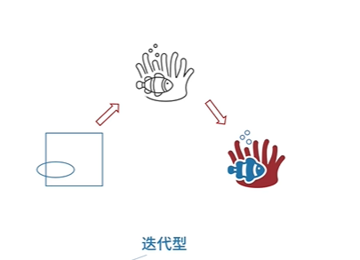

# 选择题
## 系统架构师公共知识基础
### 计算机基础
### 嵌入式系统
### 计算机网络
### 数据库系统
### 法律法规
### 数学于经济管理
### 专业英语

## 架构核心知识
### 系统工程与信息系统基础
### 软件工程
1. 软件过程模型
   - 瀑布模型
     -  需求分析（SRS） 软件设计 程序设计 编码实现 单元测试 集成测试 系统测试 运行维护
     - 特点
        - 严格区分阶段，每个阶段因果关系紧密相连
        - 只适合需求明确的项目
     - 缺点
        - 软件需求完整性，正确性难确定
        - 严格串行化，很长时间才能看到结果
        - 瀑布模型要求每个阶段一次性完全解决该阶段工作，这不现实
   - V模型
        - 内容： 
   - 原型模型
        - 内容： 
   - 螺旋模型
        - 内容：
        - 特点：
            - 以快速原型为基础+瀑布模型，同时考虑了风险问题

        
   - 构件组装模型/基于构件的开发方法（CBSE）
        - 内容： 
        - 优点： 易扩展，容易重用，降低成本，安排任务更灵活
        - 缺点： 构件设计需要经验丰富的架构师，设计不好的构件难以重用，强调重用可能牺牲其他指标性能第三方构件质量难以控制
        - CBSE的构件具备特征：
            - 可组装性： 所有外部交互必须通过公开定义的接口进行
            - 可部署性： 构件总是二进制形式的，能作为一个独立实体在平台上运行
            - 文档化： 用户根据文档来判断构件是否满足需求
            - 独立性： 可以在无其他特征构件的情况下进行组装和部署
            - 标准化： 符合某种标准化的构件模型
        - 构件组装
            顺序组装： 按顺序调用已经存在的构件，可以用两个已经存在的构件来创造一个新构件
            层次组装： 被调用构件的提供接口必须和调用构件的请求接口兼容
            叠加组装：多个构件合并形成新构件，新构件整合原构件的功能，对外提供新的接口
   - 快速应用开发RAD（瀑布+构件组装）
        - 内容： 

   - 统一过程/统一开发方法
        - 内容： 
   - 敏捷开发方法
    - 增量与迭代
      - 内容： 
      - 内容： 

2. 基于构件的软件工程
3. 逆向工程
4. 净室软件工程
5. 需求工程
6. 系统分析与设计
7. 软件测试
8. 系统运行与软件维护
    
### 软件架构设计
### 系统可靠性分析与设计
### 系统安全性与保密性

# 案例分析

# 论文写作
